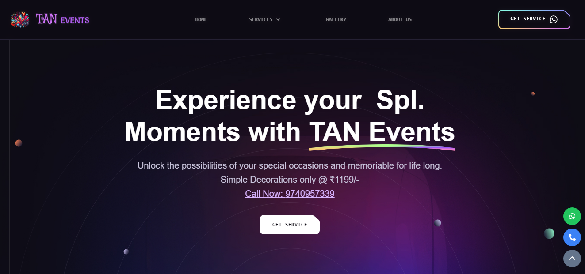
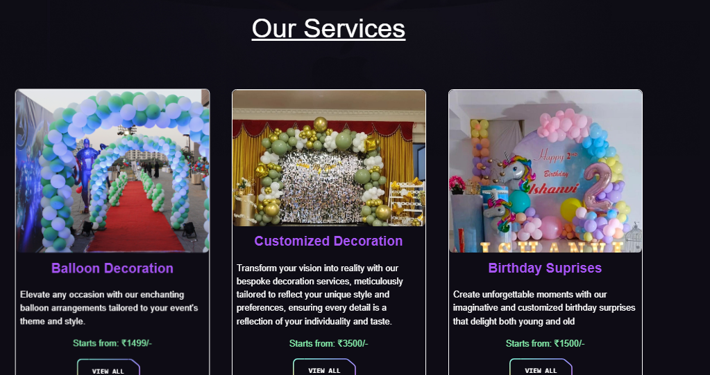
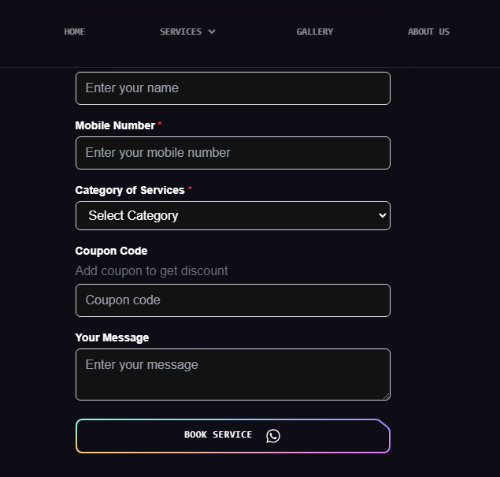
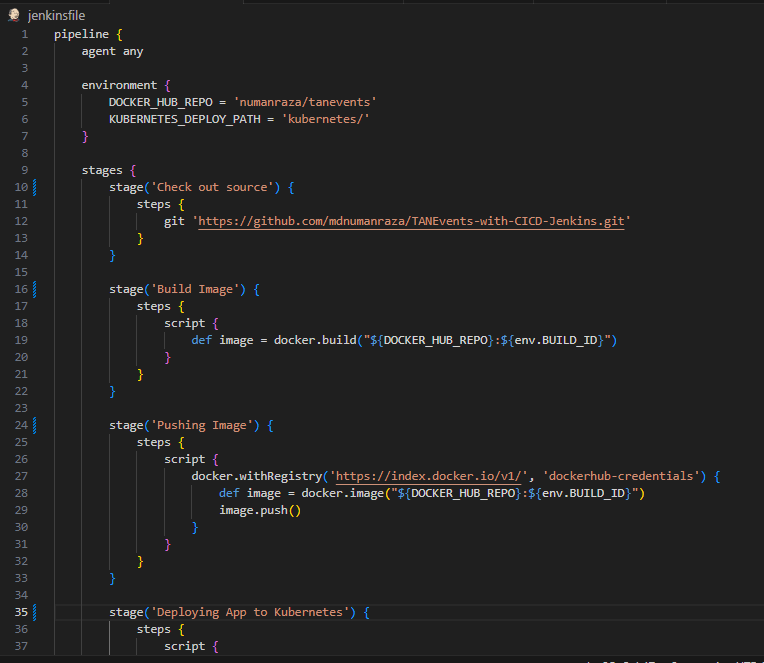
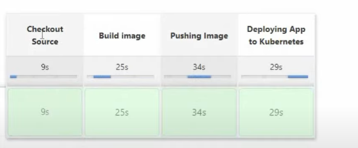

# **TAN Events - Event Management Website**

This app is built with **React** and integrates **WhatsApp** for booking services. This project also includes a CI/CD pipeline setup using **Jenkins**, **Docker**, and **Kubernetes** to ensure continuous delivery and deployment.

## **Table of Contents**
- [Features](#features)
- [Technologies Used](#technologies-used)
- [Project Structure](#project-structure)
- [Prerequisites](#prerequisites)
- [Local Development Setup](#local-development-setup)
- [CI/CD Pipeline](#cicd-pipeline)
- [Deployment](#deployment)
- [Screenshots](#screenshots)
- [Contact](#contact)

---

## **Features**
- **Service Promotion**: TAN Events offers services like event planning, catering, and decoration.
- **WhatsApp Integration**: Users can directly book services via WhatsApp through the website.
- **Responsive Design**: Optimized for desktop and mobile screens.
- **Automated Deployment**: CI/CD pipeline using Jenkins, Docker, and Kubernetes ensures smooth updates and deployment.

---

## **Technologies Used**
- **React**: Frontend framework for building the UI.
- **WhatsApp Integration**: Enables service bookings through WhatsApp.
- **Docker**: Containerization of the app.
- **Kubernetes**: For deployment and scaling.
- **Jenkins**: Automating the CI/CD pipeline.

---

## **Project Structure**
```plaintext
├── public
│   ├── index.html
│   └── ...
├── src
│   ├── components
│   ├── index.js
│   ├── App.js
│   └── ...
├── Dockerfile
├── Jenkinsfile
├── kubernetes
│   ├── deployment.yaml
│   └── service.yaml
└── README.md
```

- **`src/components/`**: React components for the website.
- **`kubernetes/`**: Kubernetes deployment and service configuration files.
- **`Dockerfile`**: Dockerfile for building the Docker image of the app.
- **`Jenkinsfile`**: Jenkins pipeline configuration.

---

## **Prerequisites**
Make sure you have the following installed on your local machine:
- **Node.js** and **npm**
- **Docker** and **Docker Hub account**
- **Kubernetes (kubectl)** and **minikube** (for local development)
- **Jenkins** (for CI/CD setup)

---

## **Local Development Setup**

1. **Clone the repository**:
   ```bash
   git clone https://github.com/mdnumanraza/TANEvents-with-CICD-Jenkins.git
   cd TANEvents-with-CICD-Jenkins
   ```

2. **Install dependencies**:
   ```bash
   npm install
   ```

3. **Start the app**:
   ```bash
   npm start
   ```

4. **Access the app**:
   The app will be running at `http://localhost:3000`.

---

## **CI/CD Pipeline**

### **Jenkins Pipeline**

This project uses Jenkins for the CI/CD pipeline to automate building and deploying the application to Kubernetes. The Jenkinsfile contains the pipeline configuration which includes:

- **Cloning the repository** from GitHub.
- **Building the Docker image** of the React app.
- **Pushing the Docker image** to Docker Hub.
- **Deploying the app** to Kubernetes.

### **Pipeline Steps**

1. **Clone repository**:
   Jenkins pulls the latest code from GitHub.

2. **Build Docker image**:
   Docker builds a production image from the `Dockerfile`.

3. **Push to Docker Hub**:
   The built Docker image is pushed to Docker Hub for deployment.

4. **Deploy to Kubernetes**:
   Kubernetes uses the latest Docker image and deploys it using `deployment.yaml` and `service.yaml`.

### **Dockerfile**
The Dockerfile for building the React app:
```Dockerfile
FROM node:16 AS build
WORKDIR /app
COPY package*.json ./
RUN npm install
COPY . .
RUN npm run build
FROM nginx:alpine
COPY --from=build /app/build /usr/share/nginx/html
EXPOSE 80
CMD ["nginx", "-g", "daemon off;"]
```

---

## **Deployment**

### **Kubernetes Deployment**

1. **Deploy to Kubernetes**:
   Use the following Kubernetes manifest files to deploy your app:
   
   - **`kubernetes/deployment.yaml`**:
     ```yaml
     apiVersion: apps/v1
     kind: Deployment
     metadata:
       name: tan-events-deployment
     spec:
       replicas: 2
       selector:
         matchLabels:
           app: tan-events
       template:
         metadata:
           labels:
             app: tan-events
         spec:
           containers:
           - name: tan-events
             image: your-dockerhub-username/tan-events:latest
             ports:
             - containerPort: 3000
     ```

   - **`kubernetes/service.yaml`**:
     ```yaml
     apiVersion: v1
     kind: Service
     metadata:
       name: tan-events-service
     spec:
       selector:
         app: tan-events
       ports:
         - protocol: TCP
           port: 3000
           targetPort: 3000
       type: LoadBalancer
     ```

2. **Access the app**:
   - Kubernetes will expose the app via a LoadBalancer. Once deployed, you can access the app using the LoadBalancer IP.

---

## **Screenshots**

### Project Flow Chart


### Landing Page


### Services


### Booking


### Jenkins Pipeline


### CICD Pipeline


---

## **Contact**
For any inquiries, please contact:

**Mohammed Numan Raza**  
mohammednuman71417@gmail.com  
https://tanevents.com

---
